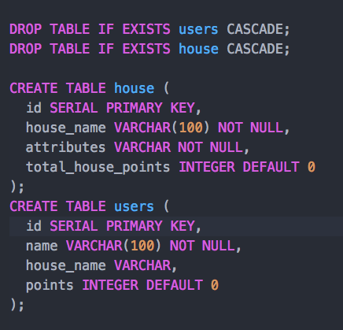
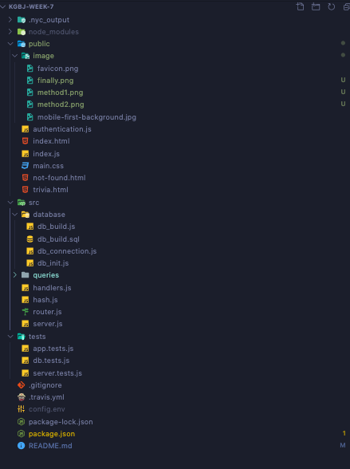
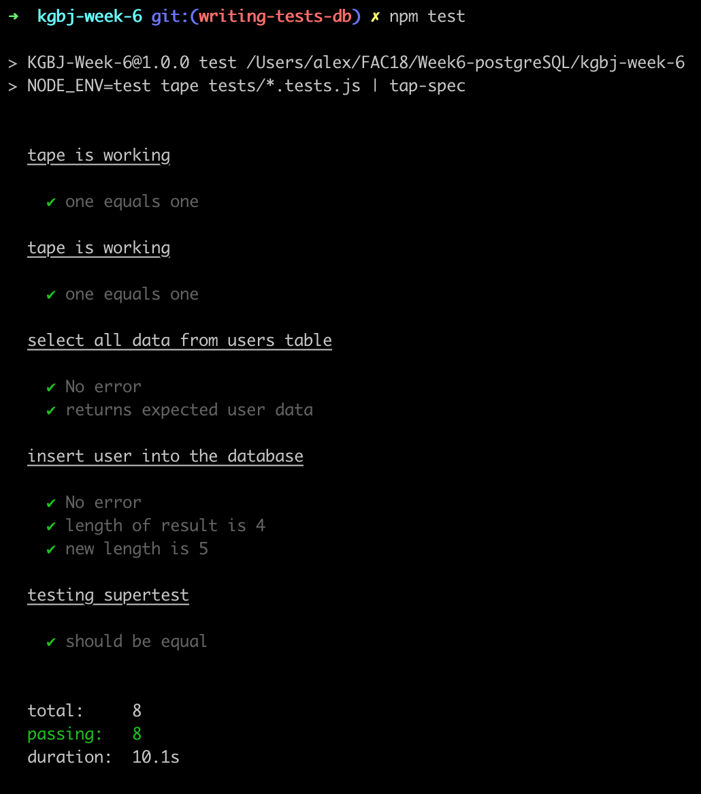
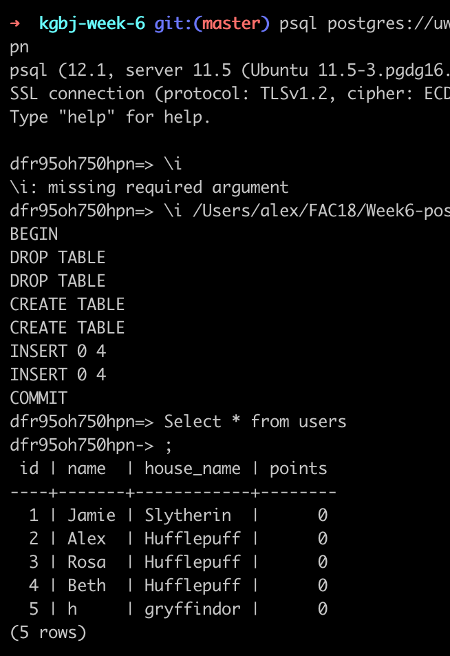
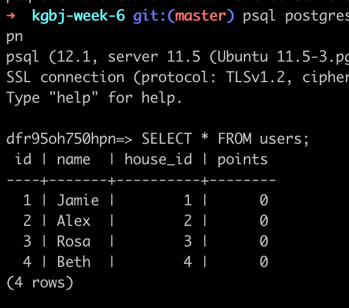

# DEV setup

*In the root directory, create an .env file with the PostgreSQL URL*
DATABASE_URL=postgres://url_to_whatever_database_you_have_access

*To build the database*
npm run db_init

*In browser*
open localhost:1234

# Requirements

- [X] Simple web app with a node server and a database
- [X] Database hosted on Heroku, or locally
- [X] Build script for your database
- [X] Security concerns appropriately considered (you must protect against script injections!)
- [X] Content dynamic, but DOM manipulation kept to a minimum
- [X] Mobile-first design
- [X] test your server routes with supertest
- [ ] test your pure functions both server and client side
- [X] set up a test database so that you can test your database queries

# PROCESS

- We spent Wednesday afternoon deciding on our theme which didn't take too much time (after forcing another group to change their plan!)
- Then we drew out wireframes so that we had a decided layout from the start
- We also drew out the relationships between each module to help decide on our schema
- In pairs we built the database and set up the server/handler

- On Thursday we had a good basis to begin with the getData and postData files
- Then we spent the rest of the day mobbing the set up of the test environment and rest of the postData
- After sorting out some problems, we had the rest of the afternoon to finish our styling and adding some extra features

# User Journey

**Founders & Coders sorting hat**<br>

*As a member of Founders & Coders, I would like to find out which house I am suited to...*<br>
I can add my name to a database<br>
Through answering questions, I can see which house I am in<br>

*As a member of Founders & Coders who is interested in who my housemates are...*<br>
I can see a table of other users and their houses<br>

*Additional requirements / stretch goals:*<br>
I can earn points depending on my answers<br>

# Schema



# Architecture



# Sorting Hat Function

```
const sortingHat = answers =>
  answers.reduce(
    (a, b, i, arr) =>
      arr.filter(v => v === a).length >= arr.filter(v => v === b).length
        ? a
        : b,
    null
  );
```

In this function we find the highest occurring element in the array.
In using the reduce() method, i = the current index making it start from the initial value,
arr = the source array of selected answers.
The function goes through and compares how many answers match to a, creating a new array of the occurrences. It does the same thing for b, and then compares which of those arrays is longer.
It repeats the process for every answer until it finds the one that repeats the most and returns the single value.  

# Tests



# sql




# Style

Harry potter theme baby!

# Problems

Merge mares
Test traumas

Smooth sailing
