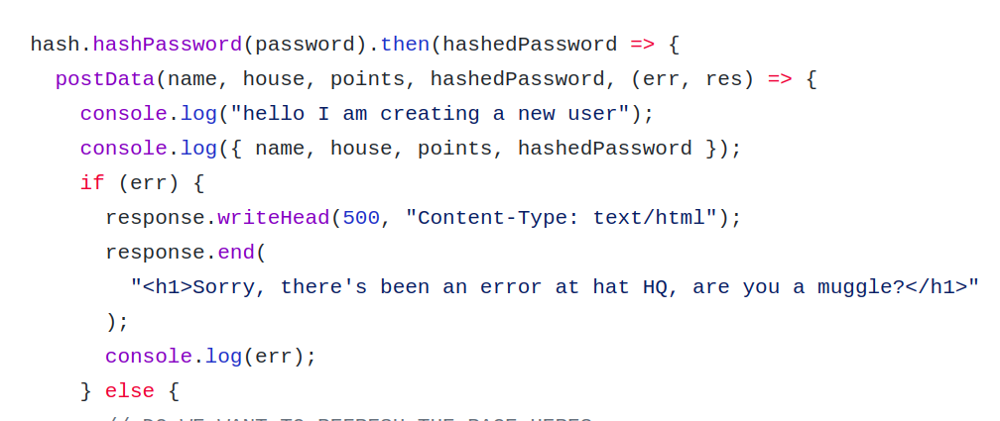
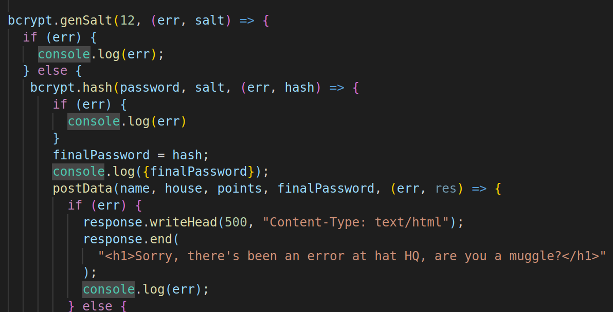
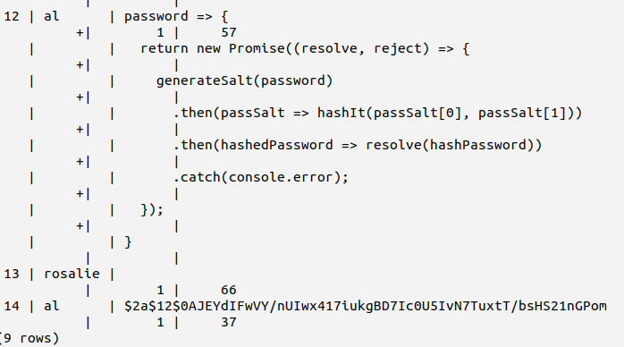

# DEV setup

**In the root directory, create an .env file with the PostgreSQL URL**
DATABASE_URL=postgres://url_to_whatever_database_you_have_access

**To build the database**
npm run db_init

**In browser**
open localhost:1234

# Current progress

At this point we dont have authentication working properly...  
Using the create user quiz and submit (sort) button we can hash and pass a username and password to the database. This would ideally also take you straight to the trivia.html where you can see the database tables represented.  

Currently the 'login' functionality does not search for an authentic user from the database. It is possible to log in with **any** credentials and be passed straight to the trivia.html (or user only) page. This will give you a cookie, which once expired would ideally give a 401 message if attempting to get back to that page without login.

Connecting these two is our main task remaining to create the mvp.

# Requirements

- [ ] Login form with 2 fields - username and password
- [ ] Users only have to log in once (i.e. implement a cookie-based session on login)
- [ ] Username is visible on each page of the site after logging in
- [ ] Any user-submitted content should be labelled with the authors username
- [ ] There should be protected routes and unprotected routes that depend on the user having a cookie or not (or what level of access they have).
- [ ] Website content should be stored in a database
- [ ] Include thorough tests on the back-end, testing pure functions and testing routes using Supertest. If you make external API calls, use Nock to mock the response for your tests.
- [ ] Test front-end logic, we don't expect tests on the DOM.


# PROCESS

- On Wednesday we decided how we wanted the rest of our project to be set up continuing from last week
- We started on 2 major parts of our project: recreating the xml request and reconfiguring the database
- We had set aside Thursday to focus on authentication and decided to mob initially that morning
- We began by creating client side validation on the submit html form
- Next we split into pairs to work on the password hashing and cookie/login.

# User Journey

**Founders & Coders sorting hat**<br>

*As a member of Founders & Coders, I would like to find out which house I am suited to...*<br>
I can create an avatar and log in to my account<br>
I want to see which hogwarts house I am sorted into<br>
Through answering questions, I can see which house I am in<br>

*As a member of Founders & Coders who is interested in who my housemates are...*<br>
I can see a tables of each house and which members are my housemates<br>

*Additional requirements / stretch goals:*<br>
I can earn more house points for my house by answering trivia<br>

# Schema


# Architecture


# Sorting Hat Function

```
const sortingHat = answers =>
  answers.reduce(
    (a, b, i, arr) =>
      arr.filter(v => v === a).length >= arr.filter(v => v === b).length
        ? a
        : b,
    null
  );
```
CHANGES?

# Problems

we had a massive issue trying to insert the hashed password into the database! eventually we managed to solve it two different ways...

Using promises...


Using callbacks


...then finally got it working **BUT** having inserted a lot of promises as passwords along the way!


